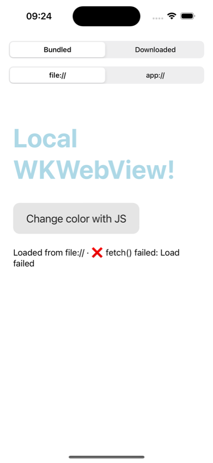
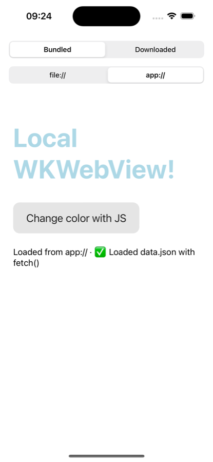

# wkwebview-local-resources
iOS and macOS app with a WKWebView that loads local resources, based on one of my SO answers.

| `file://` | `app://` |
|---|---|
|  |  |

### Currently supported:
* Local HTML, CSS and JS files shipped in the app bundle (`web/`)
* Remote HTML, CSS and JS files (as requested by edon2005):
  1) downloading [`custom_css_js.zip`](custom_css_js.zip) with `URLSession` and unzipping it with [ZIPFoundation](https://github.com/weichsel/ZIPFoundation)
  2) loading the unzipped files from Application Support in the WKWebView
* Two ways of loading those files, switchable in the app:
  * **`file://`** – `loadFileURL(_:allowingReadAccessTo:)`. Simplest option. The page has a `null` origin though, so `fetch()`, XHR and ES modules don't work.
  * **`app://`** – a [`WKURLSchemeHandler`](LocalWKWebView/LocalWKWebView/LocalSchemeHandler.swift) serves the same files under `app://local/`. The page gets a real origin and behaves like it's on a web server. The bundled page fetches `data.json` to show the difference.
* Safari Web Inspector (Develop menu) in debug builds

### Requirements:
* Xcode 26
* iOS 17+ / macOS 14+

### How to use:

1. Clone project
2. Open `LocalWKWebView/LocalWKWebView.xcodeproj` (Xcode fetches ZIPFoundation via Swift Package Manager)
3. Pick your own team under *Signing & Capabilities* if you want to run on a device
4. Run on iOS or macOS and use the two segmented controls to switch between bundled/downloaded files and `file://`/`app://`

### Where to look:
* [`WebView.swift`](LocalWKWebView/LocalWKWebView/WebView.swift) – WKWebView wrapper for SwiftUI and the two loading methods
* [`LocalSchemeHandler.swift`](LocalWKWebView/LocalWKWebView/LocalSchemeHandler.swift) – the `app://` scheme handler
* [`RemoteContent.swift`](LocalWKWebView/LocalWKWebView/RemoteContent.swift) – downloading and unzipping the remote files

On iOS 26 / macOS 26 and later SwiftUI has its own `WebView` and `WebPage` with support for custom URL schemes, so the wrapper isn't needed there.

### Based on:
https://stackoverflow.com/questions/39336235/wkwebview-does-load-resources-from-local-document-folder/39459878#39459878
